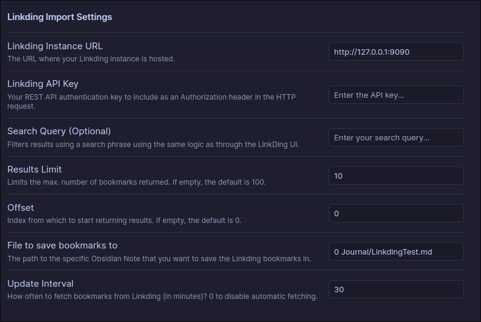

# Obsidian Linkding Bookmark Importer

This is a plugin for (https://obsidian.md).

It interacts with the [Linkding](https://github.com/sissbruecker/linkding) API to fetch and import all, or a subsection, of your bookmarks into your Obsidian Vault.

## Configuration
- Set your 
  - Linkding URL, eg. http://localhost:9090
  - Linkding API Key (Found on Linkding settings page)
  - File to save bookmarks to: An MD file within your Obsidian Vault
- Optionally you can set these additional parameters:
  - Search Query - Only return bookmarks that are returned for this query
  - Results Limit - How many bookmarks to fetch
  - Offset - Index from which to start returning results.

## References
- Linkding: https://github.com/sissbruecker/linkding